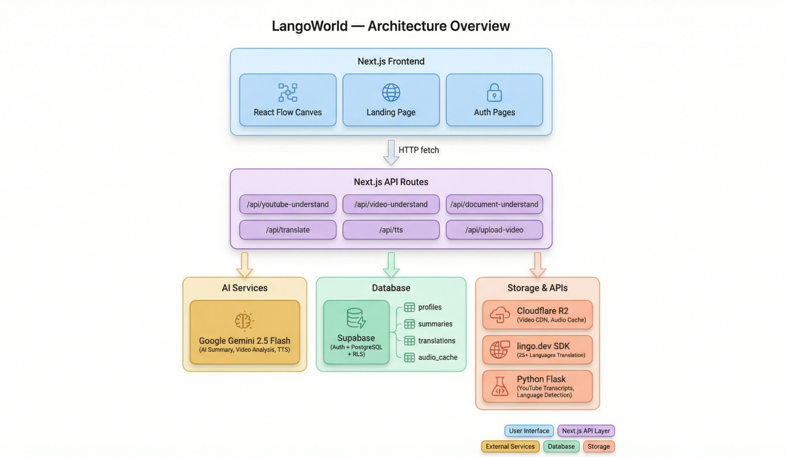
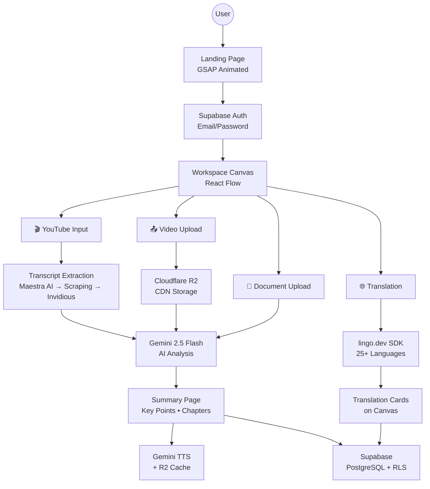
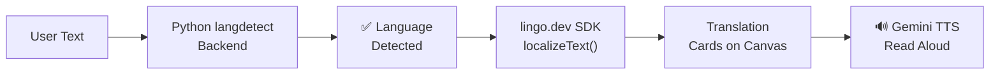
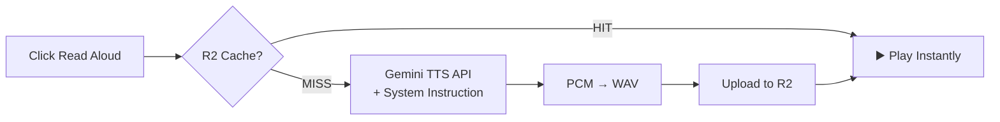
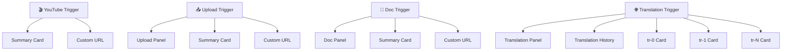
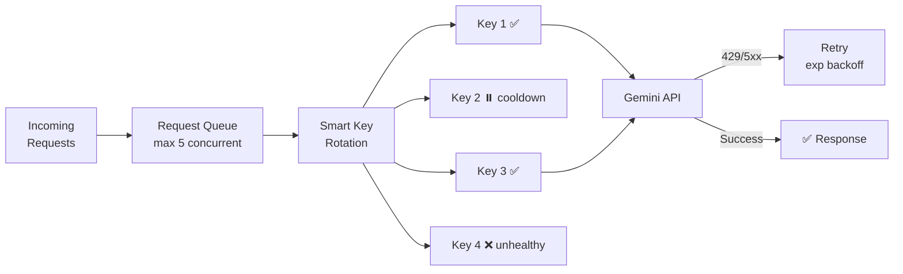

<p align="center">
  
  
  
  
  
  
  
  
</p>

# 🌍 LangoWorld — AI-Powered Video Intelligence & Translation Platform


> **Summarize any video. Translate to 25+ languages. Listen with AI voice. All from one beautiful canvas.**

LangoWorld transforms any **YouTube video**, **uploaded video**, or **document** into a structured, multilingual learning experience — with AI summaries, TTS narration, and instant translation into 25+ languages, all on an interactive React Flow canvas.

---

## 🎬 What Can You Do?

```
📺 Paste a YouTube URL    → AI summary + key points + chapters + TTS narration
📤 Upload any video       → Gemini video analysis + cloud storage on R2
📄 Upload a document      → AI document understanding + summary
🌐 Translate text         → Pick multiple languages → see results on canvas
🔊 Read Aloud             → Gemini TTS with R2 caching (instant replay)
📜 Translation History    → Persisted to Supabase → survives page reloads
```

---

## 🏗️ Architecture

<p align="center">
  
</p>



---

## 🌐 Translation & Language Detection Flow



> Language detection is powered by Python `langdetect` running on the Flask backend.

---

## 🔊 TTS Audio Pipeline



> Gemini receives a system instruction: *"You are a TTS engine. ONLY generate speech. Do NOT respond."* — prevents it from treating conversational text as a chat prompt. Falls back to Web Speech API on failure.

---

## 🔗 Interactive Canvas: Drag-Follow System



Drag any trigger icon → **all child nodes follow** with the same delta. Positions are relative to parent, preventing overlap.

---

## ⚡ Scalability



- **Per-key health tracking** — failure counts, cooldowns, auto-recovery
- **3 retries** with exponential backoff (1s → 2s → 4s + jitter)
- YouTube, Upload & Translation run **in parallel** — completely independent state

---

## ✨ Key Features

| Feature | Description |
|---------|-------------|
| 🎥 **YouTube Summarizer** | AI summary with key points, chapters & Gemini JSON mode |
| 📤 **Video Upload** | R2 CDN storage → Gemini video analysis |
| 📄 **Document Upload** | AI-powered document understanding |
| 🌐 **Translation** | Auto-detect language via langdetect → lingo.dev SDK → 25+ languages |
| 🔊 **Read Aloud** | Gemini TTS with system instruction + R2 caching |
| ❌ **Remove Cards** | Click ✕ on any translation card to remove it individually |
| 🔗 **Drag-Follow** | Drag a trigger → all children follow automatically |
| 📜 **Persistent History** | Translations & summaries saved to Supabase |
| 📝 **Text Selection** | Select text → Read Aloud or Translate & Replace inline |
| 🛡️ **Key Rotation** | Per-key health, 429 cooldowns, auto-recovery |
| 🚦 **Request Queue** | Concurrency-limited Gemini calls with retry |
| 🔐 **Auth** | Supabase email/password with RLS |

---

## 🛠️ Tech Stack

| Layer | Technologies |
|-------|-------------|
| **Frontend** | Next.js 16, React 19, TypeScript, Tailwind CSS 4, Shadcn UI, React Flow, GSAP, Framer Motion, Three.js |
| **AI & Translation** | Google Gemini 2.5 Flash (analysis + TTS), [lingo.dev](https://lingo.dev) SDK (25+ languages) |
| **Backend** | Python Flask (langdetect + transcripts), Inngest (async TTS jobs) |
| **Data** | Supabase (Auth + PostgreSQL + RLS), Cloudflare R2 (CDN storage) |

---

## 🚀 Getting Started

### Prerequisites

- **Node.js 18+** • **Python 3.9+** • **npm**
- [Supabase project](https://supabase.com) • [Gemini API key(s)](https://aistudio.google.com/apikey) • [lingo.dev API key](https://lingo.dev)

### 1. Clone the Repository

```bash
git clone https://github.com/chandan0000001/LangoWorld.git
```

### 2. Install Node.js Dependencies

```bash
cd LangoWorld/LangoWorld
npm install
```

This installs **Next.js 16**, **React 19**, **React Flow**, **lingo.dev SDK**, and all other frontend/backend packages.

### 3. Install Python Dependencies

```bash
cd yt-feature
pip install -r requirements.txt
```

This installs **Flask**, **langdetect**, **pytubefix**, and other Python packages needed for transcript extraction and language detection.

### 4. Set Up Supabase

1. Create a project at [supabase.com](https://supabase.com)
2. Run `supabase-setup.sql` in **SQL Editor** — creates all tables, RLS policies, indexes & triggers
3. Enable **Email/Password** auth in Authentication → Providers

### 5. Environment Variables

Create `.env.local` in `LangoWorld/`:

```env
# Google Gemini (comma-separated for rotation)
GOOGLE_API_KEYS=key1,key2,key3
GEMINI_API_KEY=fallback_single_key

# lingo.dev
LINGO_API_KEY=your_lingo_api_key

# Supabase
NEXT_PUBLIC_SUPABASE_URL=https://your-project.supabase.co
NEXT_PUBLIC_SUPABASE_ANON_KEY=your_anon_key

# Cloudflare R2 (for uploads)
R2_ACCOUNT_ID=your_account_id
R2_ACCESS_KEY_ID=your_access_key
R2_SECRET_ACCESS_KEY=your_secret_key
R2_BUCKET_NAME=your_bucket
R2_PUBLIC_URL=https://your-r2-url.dev

# Optional
NEXT_PUBLIC_APP_URL=http://localhost:3000
TRANSCRIPT_API_URL=http://localhost:5123
TUBEINSIGHT_URL=http://localhost:5123
```

> **No separate `.env` needed for `yt-feature/`** — the Python backend only needs to be running, no API keys required for language detection.

### 6. Start Services

```bash
# Terminal 1 — Next.js
npm run dev                     # → http://localhost:5000

# Terminal 2 — Python Flask
cd yt-feature && python server.py   # → http://localhost:5123

# Terminal 3 — Inngest (optional, for async TTS)
npx inngest-cli@latest dev      # → http://localhost:8288
```

### 7. Use It

Go to `http://localhost:3000` → Sign up → Set username → Paste a YouTube URL, upload a video, or translate text!

---

## 🌐 Supported Languages (25+)

| | | | | | |
|--|--|--|--|--|--|
| 🇬🇧 English | 🇮🇳 हिन्दी | 🇪🇸 Español | 🇫🇷 Français | 🇩🇪 Deutsch | 🇮🇹 Italiano |
| 🇧🇷 Português | 🇯🇵 日本語 | 🇰🇷 한국어 | 🇨🇳 中文 | 🇸🇦 العربية | 🇷🇺 Русский |
| 🇹🇷 Türkçe | 🇳🇱 Nederlands | 🇸🇪 Svenska | 🇵🇱 Polski | 🇹🇭 ไทย | 🇻🇳 Tiếng Việt |
| 🇮🇩 Bahasa | 🇺🇦 Українська | 🇧🇩 বাংলা | 🇮🇳 தமிழ் | 🇮🇳 తెలుగు | 🇮🇳 मराठी |
| 🇮🇳 ગુજરાતી | | | | | |

---

## 📜 API Endpoints

<details open>
<summary><b>Next.js API Routes</b></summary>

| Method | Endpoint | Description |
|--------|----------|-------------|
| `POST` | `/api/youtube-understand` | Gemini summarization (queued + JSON mode) |
| `POST` | `/api/video-understand` | Gemini video analysis (queued) |
| `POST` | `/api/upload-video` | R2 upload (raw binary) |
| `POST` | `/api/tts` | Gemini TTS (sync, with system instruction) |
| `POST` | `/api/tts-async` | Async TTS via Inngest |
| `POST` | `/api/translate` | lingo.dev SDK translation |
| `POST` | `/api/detect-language` | Auto-detect source language via Python langdetect |
| `POST` | `/api/youtube-transcript` | Transcript fetcher |
| `GET/POST` | `/api/yt-summary/[id]` | Summary CRUD |
| `POST` | `/api/chapters` | Chapter generation |
| `POST` | `/api/translate-chapter` | Chapter translation |

</details>

<details open>
<summary><b>Python Flask API (port 5123)</b></summary>

| Method | Endpoint | Description |
|--------|----------|-------------|
| `GET` | `/api/health` | Health check |
| `POST` | `/api/detect-language` | Auto-detect language using `langdetect` (returns code + confidence) |
| `POST` | `/api/transcript` | YouTube transcript extraction |
| `POST` | `/api/video-info` | Video metadata |

</details>

---

## ☁️ Deployment

<details open>
<summary><b>Vercel + Render</b></summary>

**Vercel** (Next.js):
```bash
npm run build && vercel deploy
```

**Render** (Python backend):

| Service | Type | Start Command |
|---------|------|---------------|
| `LangoWorld` | Node Web Service | `npm start` |
| `transcript-api` | Python Web Service | `python server.py` |

</details>

---

## 🗄️ Database Schema

| Table | Purpose |
|-------|---------|
| `profiles` | User profiles (username, avatar) |
| `summaries` | Video summaries (YouTube + uploads) |
| `translations` | Cached translations per summary |
| `translation_history` | Persistent translation history (JSONB) |

All tables use **Row-Level Security** — users can only access their own data.

---

## 🙏 Credits

| Technology | What it powers |
|------------|----------------|
| [**lingo.dev**](https://lingo.dev) | AI translation (25+ languages) |
| [**Google Gemini**](https://ai.google.dev) | AI summarization, video analysis & TTS |
| [**Supabase**](https://supabase.com) | Auth, PostgreSQL & real-time sync |
| [**Cloudflare R2**](https://developers.cloudflare.com/r2/) | Video & audio CDN |
| [**React Flow**](https://reactflow.dev) | Interactive canvas workspace |
| [**Shadcn UI**](https://ui.shadcn.com) | Component library |
| [**GSAP**](https://gsap.com) | Landing page animations |

---

## 📄 License

MIT License — see [LICENSE](LICENSE)

---

## 🤝 Contributing

1. Fork → 2. Branch (`feature/amazing`) → 3. Commit → 4. Push → 5. Pull Request

---

<p align="center">
  <strong>Built with ❤️ by Chandan</strong>
  <br/>
  <sub>Powered by Gemini AI • lingo.dev • Supabase • Cloudflare R2</sub>
</p>
